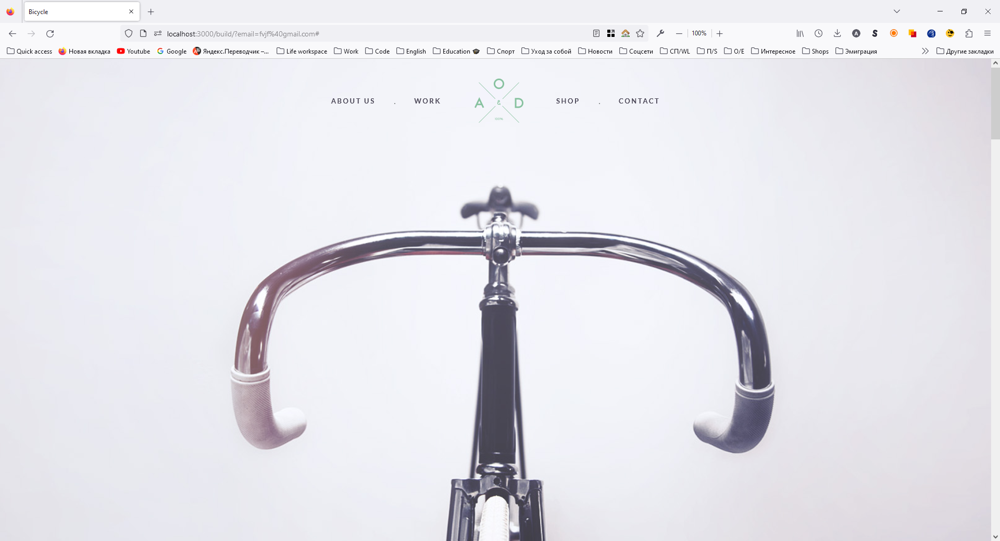
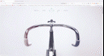

# AOD
## :uk: English
__Description:__ Adaptive landing page with plenty of pictures

__Deployed project:__ http://aod.alexander-portfolio-and-cv.com

__Used technologies:__

- HTML5
- SCSS
- Adaptive-responsive layout
- Grid layout
- Javascript
- Siema slider

__About project:__ AOD is modern adaptive landing with large number of pictures and flexible design that adapts to any resolution. SCSS preprocessor and Grid layout were used for more advanced style. Also Javascript was employed for better functionality.

## :ru: Русский
__Описание:__ Адаптивный лендинг с большим количеством изображений

__Развернутый проект:__ http://aod.alexander-portfolio-and-cv.com

__Использованные технологии:__

- HTML5
- SCSS
- Адаптивно-отзывчивая верстка
- Grid разметка
- Javascript
- Siema slider

 

__О проекте:__ AOD - это современный лендинг с большим количеством адаптивных изображений и дизайном который гибко подстраивается под любое разрешение экрана. При создании лендинга был использован препроцессор SCSS, разметка Grid и Javascript для обеспечения функциональности.

 

## Preview/Превью

